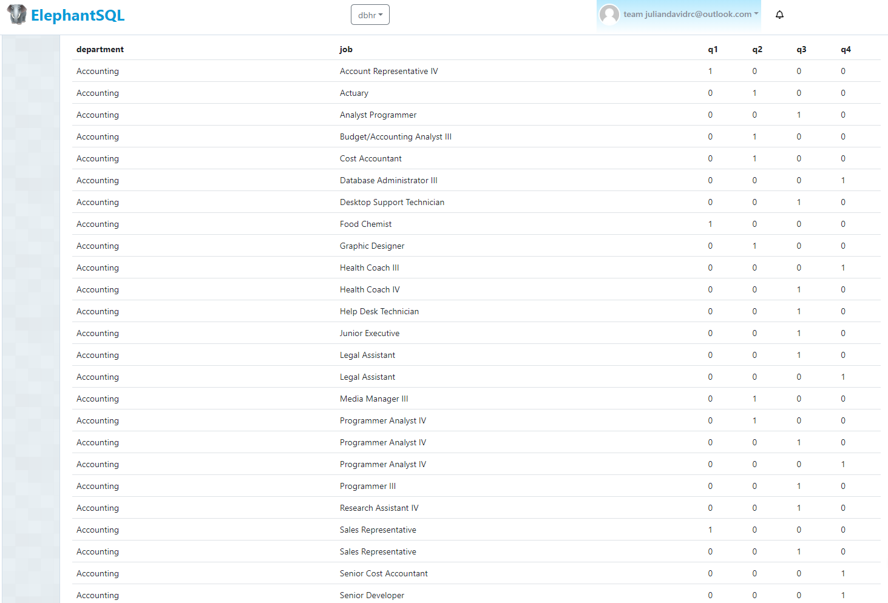
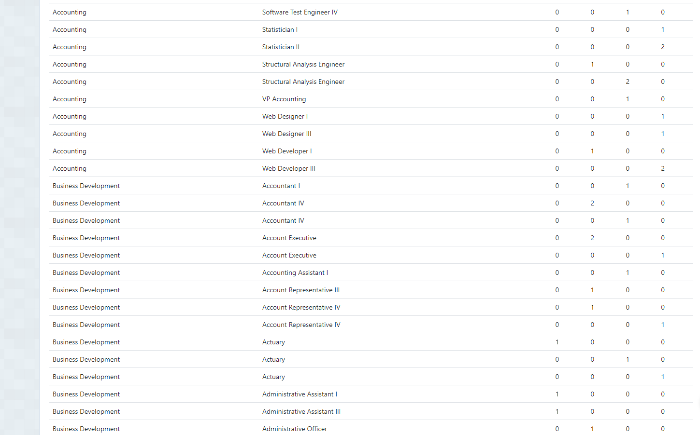
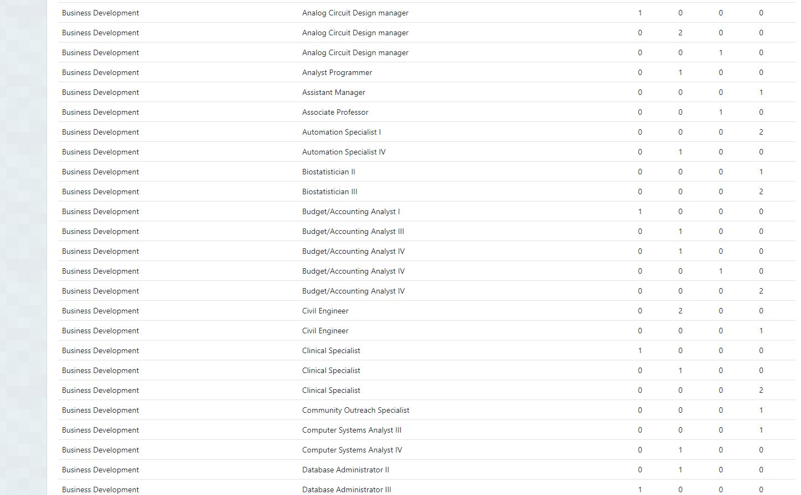
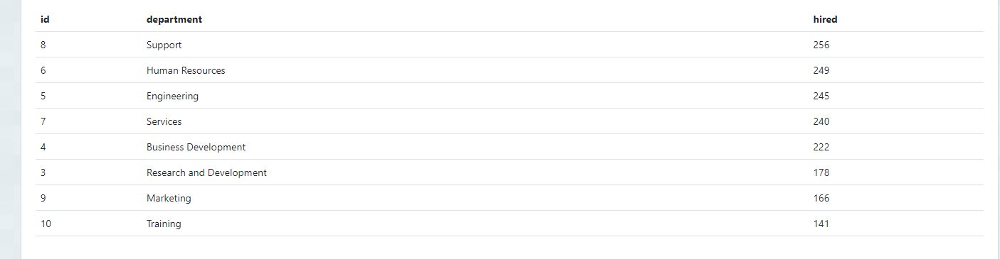

# Local RestApi / Python Load Data

## Endpoint to load batch 1 up to 1000 transactions (HTTP Post Request)

* Load hired employees data 
http://127.0.0.1:5000/load/hired_employees

* Load dimension data (departments & jobs)
http://127.0.0.1:5000/load/dims

## Endpoint Query Requirements (HTTP GET Request)

* Query1: Number of employees hired for each job and department in 2021 divided by quarter. The table must be ordered alphabetically by department and job.
http://127.0.0.1:5000/query/req1, endpoint JSON result [jsonqry1](results_querys_endpoint/qry1.json)

* Query2: List of ids, name and number of employees hired of each department that hired more employees than the mean of employees hired in 2021 for all the departments, ordered by the number of employees hired (descending).
http://127.0.0.1:5000/query/req2, endpoint JSON result 

